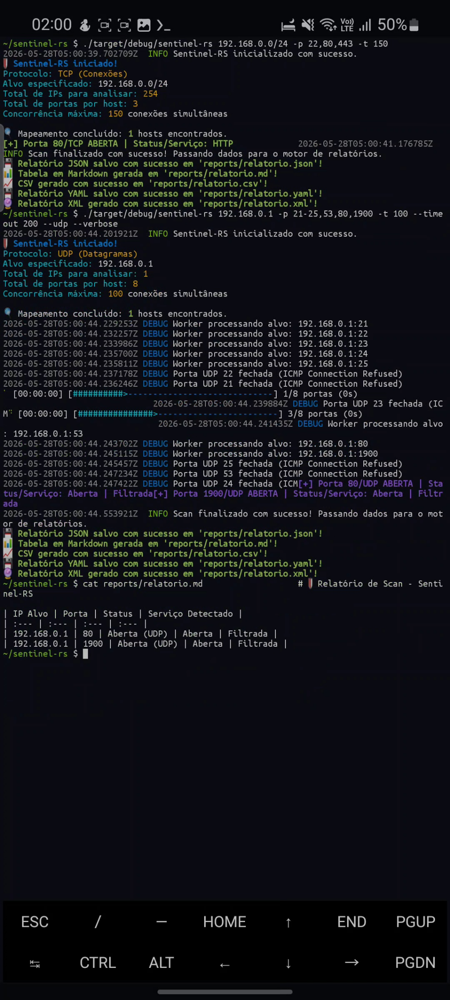

Sentinel-RS 🛡️🦀

Sentinel-RS é uma ferramenta experimental de network scanning desenvolvida em Rust com foco em concorrência assíncrona, performance e exploração de conceitos de infraestrutura/security tooling.

O projeto foi arquitetado para rodar de forma eficiente inclusive em ambientes móveis via Termux (Android/ARM), utilizando o runtime assíncrono do Tokio para gerenciar centenas de conexões simultâneas.

---

🚀 Funcionalidades

- Scanner híbrido TCP + UDP
- Suporte a ranges e parsing dinâmico de portas
- Scanner CIDR para sub-redes inteiras
- Descoberta de hosts ativos
- DNS reverso real via PTR, opcional com `--reverse-dns`
- Fingerprinting básico de serviços
- Parsing HTTP/HTTPS
- Controle de concorrência com workers e semáforos
- Timeout configurável
- Logs verbose/debug
- Exportação de relatórios em:
  - JSON
  - CSV
  - XML
  - YAML
  - Markdown

---

🧠 Arquitetura

O Sentinel-RS utiliza uma arquitetura assíncrona baseada em:

- Tokio Runtime
- Workers concorrentes
- Queue de tarefas ("mpsc")
- Controle de throttling via "Semaphore"
- Timeout handling
- Probing TCP/UDP paralelo

Fluxo simplificado:

```bash
CIDR/IP
   ↓
Host Discovery
   ↓
Queue de Scanning
   ↓
Workers Concorrentes
   ↓
Fingerprinting
   ↓
Exportação de Relatórios
```
---

📸 Demonstração



---

🛠️ Tecnologias Utilizadas

- Rust
- Tokio
- Tokio-Rustls
- Futures
- Async Networking
- TCP/UDP Sockets
- Resolução PTR via resolvedor do sistema (`libc::getnameinfo`)
- ICMP Handling

---

📦 Rodando no Termux (Android)

Instalação
```bash
pkg update && pkg upgrade
pkg install rust clang make git
```
Clone o projeto
```bash
git clone https://github.com/LuizGrochevski/Sentinel-RS.git
cd Sentinel-RS
```
Compile e execute
```bash
cargo run --release -- 192.168.0.0/24 -p 22,80,443 -t 150
```
---

📄 Exemplo de uso

TCP Scan
```bash
cargo run -- 192.168.0.0/24 -p 22,80,443
```
TCP Scan com Reverse DNS
```bash
cargo run -- 192.168.0.0/24 -p 22,80,443 --reverse-dns
```
UDP Scan
```bash
cargo run -- 192.168.0.1 -udp -p 53,80,1900
```
Verbose Debug
```bash
cargo run -- 192.168.0.1 -udp -p 21-25,53,80,1900 --verbose
```
---

📌 Reverse DNS

Por padrão, o scanner mantém dependências e execução leves para ambientes como Termux e usa apenas o IP puro para conectar aos alvos. Para consultar registros PTR reais e preencher a coluna/campo de hostname nos relatórios, habilite:

```bash
cargo run -- 192.168.0.0/24 -p 22,80,443 --reverse-dns
```

Os relatórios exportados separam `ip` e `hostname`; quando o hostname não é resolvido, o campo fica vazio ou marcado como `-` no Markdown.
---

📊 Exemplo de saída
```bash
🛡 Sentinel-RS iniciado!
Protocolo: UDP (Datagramas)
Alvo especificado: 192.168.0.1
Total de IPs para analisar: 1
Total de portas por host: 8
Concorrência máxima: 100 conexões simultâneas

🔍 Mapeamento concluído: 1 hosts encontrados.
2026-05-28T16:36:37.269607Z DEBUG Worker processando alvo: 192.168.0.1:21
2026-05-28T16:36:37.271011Z DEBUG Worker processando alvo: 192.168.0.1:22
2026-05-28T16:36:37.272065Z DEBUG Worker processando alvo: 192.168.0.1:23
2026-05-28T16:36:37.273159Z DEBUG Worker processando alvo: 192.168.0.1:24
2026-05-28T16:36:37.273324Z DEBUG Worker processando alvo: 192.168.0.1:25
2026-05-28T16:36:37.274402Z DEBUG Worker processando alvo: 192.168.0.1:53
2026-05-28T16:36:37.275064Z DEBUG Worker processando alvo: 192.168.0.1:80
2026-05-28T16:36:37.275797Z DEBUG Worker processando alvo: 192.168.0.1:1900
2026-05-28T16:36:37.283372Z DEBUG Porta UDP 21 fechada (ICMP Connection Refused)
[00:00:00] [#####>-------------------------------------] 1/8 portas (0s)
2026-05-28T16:36:37.283940Z DEBUG Porta UDP 22 fechada (ICMP Connection Refused)
[+] Porta 53/UDP ABERTA | Status/Serviço: Aberta | Filtrada (Sem resposta ao Probe)
[+] Porta 23/UDP ABERTA | Status/Serviço: Aberta | Filtrada
[+] Porta 80/UDP ABERTA | Status/Serviço: Aberta | Filtrada
[+] Porta 25/UDP ABERTA | Status/Serviço: Aberta | Filtrada
[+] Porta 1900/UDP ABERTA | Status/Serviço: Aberta | Filtrada
[+] Porta 24/UDP ABERTA | Status/Serviço: Aberta | Filtrada
2026-05-28T16:36:37.430002Z  INFO Scan finalizado com sucesso! Passando dados para o motor de relatórios.

💾 Relatório JSON salvo com sucesso em 'reports/relatorio.json'!
📊 Tabela em Markdown gerada em 'reports/relatorio.md'!
📈 CSV gerado com sucesso em 'reports/relatorio.csv'!
💾 Relatório YAML salvo com sucesso em 'reports/relatorio.yaml'!
🔮 Relatório XML gerado com sucesso em 'reports/relatorio.xml'!

```
---

🧪 Objetivos do Projeto

O Sentinel-RS foi criado como laboratório prático para estudo de:

- programação assíncrona em Rust
- concorrência segura
- networking de baixo nível
- scanning de rede
- fingerprinting
- arquitetura de ferramentas de infraestrutura
- otimização para ambientes ARM/mobile

---

🛣️ Roadmap

- SYN Scan (raw sockets)
- Fingerprinting avançado
- TLS fingerprinting
- Worker pools dedicados
- Structured logging ("tracing")
- Compatibilidade parcial com Nmap XML
- UDP improvements
- Service signature database

---

⚠️ Aviso

Este projeto é destinado exclusivamente para fins educacionais, laboratoriais e auditorias autorizadas em ambientes controlados.
